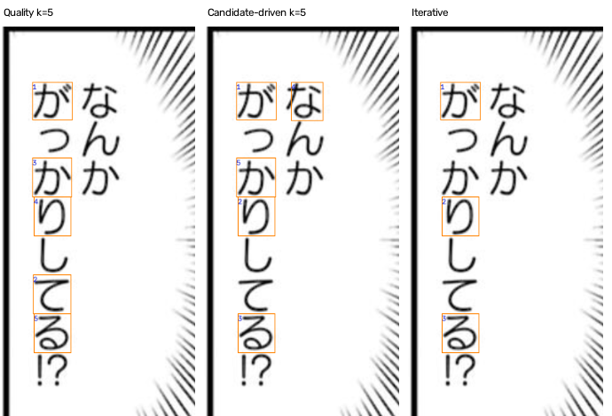
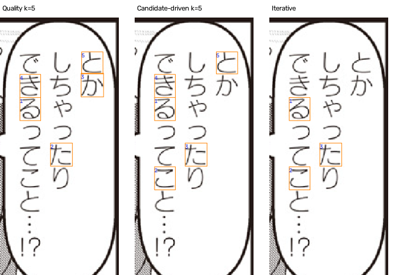
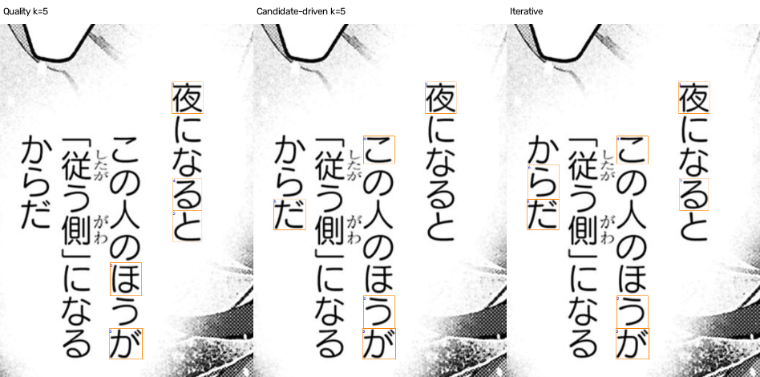
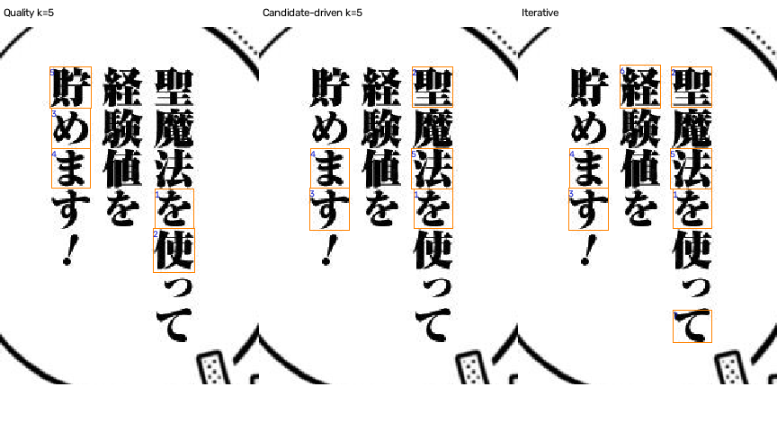
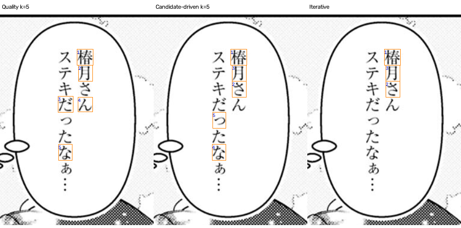
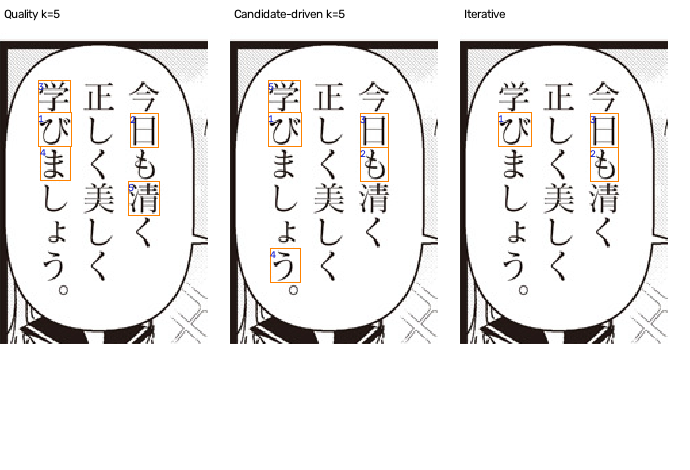
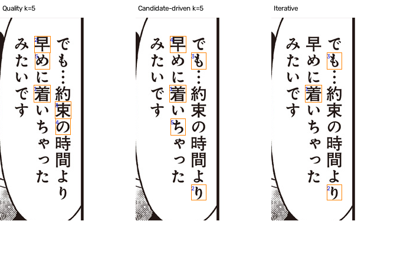
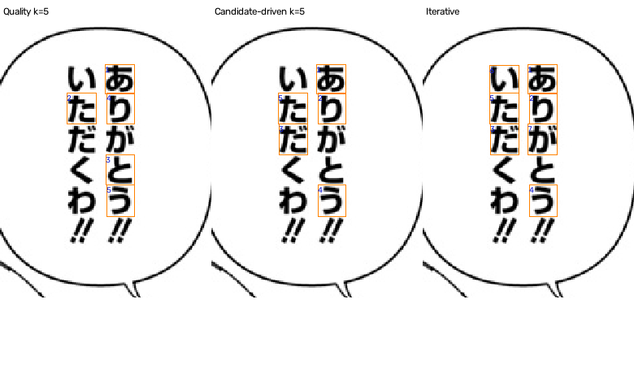
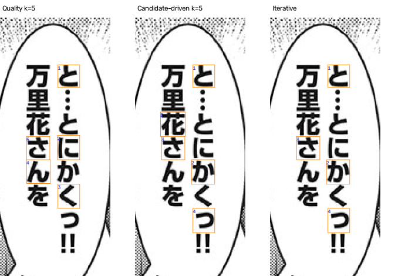

# 候选驱动选字与迭代补字验证

## 结论

本轮没有证明候选驱动选字比清晰度选字稳定更准。3字预算为5/9对6/9，5字均为6/9，7字为6/9对8/9；3字Top-3覆盖由8/9升至9/9，但样本很小且已暴露。暂不替换清晰度基线。
q72受益于针对性补字，但q100、q58出现退步。实验早停在q91、q96错误收敛，故默认关闭自动早停；证据指数不能用于自动放行。
字形表按固定em像素渲染比较，而截图匹配会收紧墨迹并归一化尺寸，两者的距离语义尚未对齐。这可能让选字器偏好实际匹配中已被抹去的差异，是下一步需验证的假设，不是已确认根因。优先统一归一化与距离，并在冻结策略后用新样本验证，而不是继续对这9题调参。
字体表覆盖254字符（84平假名、88片假名），23字体、14家族及16/24/32/48/64px五档。近似共享基于栅格距离，不是矢量轮廓共享证明；本轮未发现跨家族零距离，也不代表不存在共享字形。

## 评估边界

同一9张已暴露开发图，扩展为127个人工核对的字符裁片。此轮不是新盲测、不是自动OCR，也不是整页端到端测试。
每种策略使用同一23款字体、14个候选家族、同一固定混合匹配距离与同一个字符池。清晰度基线也去重相同字符，避免把去重收益误归给区分表。
同字匹配可预先缓存，但选下一个字的函数不接收未选字符的匹配分；它只使用既有候选、字符、裁片质量、分辨率和字体区分表。

## 同预算配对结果

| 策略 | Top-1中文大类一致 | Top-3包含中文答案 | 总取字数 |
|---|---:|---:|---:|
| quality_3 | 6/9 | 8/9 | 27 |
| active_3 | 5/9 | 9/9 | 27 |
| quality_5 | 6/9 | 9/9 | 45 |
| active_5 | 6/9 | 9/9 | 45 |
| quality_7 | 8/9 | 9/9 | 63 |
| active_7 | 6/9 | 9/9 | 63 |
| iterative | 5/9 | 9/9 | 40 |
| all_pool_reference | 6/9 | 9/9 | 127 |

all_pool_reference只是用全部可用字符的参考，不是理论上限，也不是精确源字体真值。

## 每题选字轨迹和实际截图

每张图从左到右：最清晰5字、候选驱动5字、自动停止的迭代结果。框内数字为查询顺序；字符读法见表。

### q115 · 题库答案：圆体

| 策略 | 选中字符 | 第一候选 / 中文答案 |
|---|---|---|
| quality_5 | がてかりる | 新丸ゴ / 圆体 |
| active_5 | がりるなか | 新丸ゴ / 圆体 |
| iterative | がりる | 新丸ゴ / 圆体 |

停止原因：`enough_discriminating_evidence`。证据状态：`discriminating_evidence_present`。

- 对比 `skip`：supports_candidate=がりる
- 对比 `humming`：supports_candidate=がりる

### q91 · 题库答案：圆体

| 策略 | 选中字符 | 第一候选 / 中文答案 |
|---|---|---|
| quality_5 | るたかきと | 攸望黑体（日文） / 黑体 |
| active_5 | るこたきと | 攸望黑体（日文） / 黑体 |
| iterative | るこた | 攸望黑体（日文） / 黑体 |

停止原因：`enough_discriminating_evidence`。证据状态：`discriminating_evidence_present`。

- 对比 `shinmaru`：supports_candidate=るた；inconclusive=こ
- 对比 `humming`：supports_candidate=るこ；inconclusive=た

### q100 · 题库答案：圆体

| 策略 | 选中字符 | 第一候选 / 中文答案 |
|---|---|---|
| quality_5 | 夜とがるほ | 新丸ゴ / 圆体 |
| active_5 | 夜うがこだ | Humming / 轻吟体 |
| iterative | 夜うがこだらる | Humming / 轻吟体 |

停止原因：`budget_exhausted`。证据状态：`needs_more_discriminating_glyphs`。

- 对比 `shinmaru`：supports_candidate=夜だらう；supports_rival=がるこ
- 对比 `skip`：supports_candidate=夜だらこ；inconclusive=がう；supports_rival=る

### q72 · 题库答案：宋体

| 策略 | 选中字符 | 第一候选 / 中文答案 |
|---|---|---|
| quality_5 | を使めま貯 | Antique AN+ / 黑体 |
| active_5 | を聖すま法 | Ryumin / 宋体 |
| iterative | を聖すま法経て | Ryumin / 宋体 |

停止原因：`budget_exhausted`。证据状态：`needs_more_discriminating_glyphs`。

- 对比 `mystery`：inconclusive=をす；supports_candidate=ま聖；supports_rival=法経て
- 对比 `antique`：supports_candidate=を法；inconclusive=ま経聖て；supports_rival=す

### q114 · 题库答案：宋体

| 策略 | 选中字符 | 第一候选 / 中文答案 |
|---|---|---|
| quality_5 | 椿月だんな | Ryumin / 宋体 |
| active_5 | 椿さ月なっ | Ryumin / 宋体 |
| iterative | 椿さ月 | Ryumin / 宋体 |

停止原因：`enough_discriminating_evidence`。证据状态：`discriminating_evidence_present`。

- 对比 `antique`：supports_candidate=椿月さ
- 对比 `mystery`：supports_candidate=椿月さ

### q92 · 题库答案：宋体

| 策略 | 选中字符 | 第一候选 / 中文答案 |
|---|---|---|
| quality_5 | び日学ま清 | Ryumin / 宋体 |
| active_5 | びも日う学 | Ryumin / 宋体 |
| iterative | びも日 | Ryumin / 宋体 |

停止原因：`enough_discriminating_evidence`。证据状态：`discriminating_evidence_present`。

- 对比 `mystery`：inconclusive=び；supports_candidate=日も
- 对比 `antique`：supports_candidate=び日も

### q125 · 题库答案：黑体

| 策略 | 选中字符 | 第一候选 / 中文答案 |
|---|---|---|
| quality_5 | 着早束のめ | Antique AN+ / 黑体 |
| active_5 | 着りも早ち | Antique AN+ / 黑体 |
| iterative | 着りも | Antique AN+ / 黑体 |

停止原因：`enough_discriminating_evidence`。证据状态：`discriminating_evidence_present`。

- 对比 `ryumin`：supports_candidate=着りも
- 对比 `mystery`：supports_candidate=着りも

### q58 · 题库答案：黑体

| 策略 | 选中字符 | 第一候选 / 中文答案 |
|---|---|---|
| quality_5 | あたとりう | 攸望黑体（日文） / 黑体 |
| active_5 | ありだうた | 攸望黑体（日文） / 黑体 |
| iterative | ありだうたいが | 新丸ゴ / 圆体 |

停止原因：`budget_exhausted`。证据状态：`needs_more_discriminating_glyphs`。

- 对比 `ywheiti`：inconclusive=あう；supports_rival=ただ；supports_candidate=りがい
- 对比 `skip`：supports_candidate=ありうがい；inconclusive=ただ

### q96 · 题库答案：黑体

| 策略 | 选中字符 | 第一候选 / 中文答案 |
|---|---|---|
| quality_5 | とにくんさ | 新丸ゴ / 圆体 |
| active_5 | とかさっ花 | 新丸ゴ / 圆体 |
| iterative | とかさっ | 新丸ゴ / 圆体 |

停止原因：`enough_discriminating_evidence`。证据状态：`discriminating_evidence_present`。

- 对比 `ywheiti`：inconclusive=とさ；supports_candidate=っか
- 对比 `RodinHappyPro-UB`：inconclusive=とさ；supports_candidate=っか

## 置信解释的变化

同一个字重复出现只算一次证据。字体表在当前分辨率下判为共享或近似的字，只算中性证据，即便微小噪声使它在图像匹配中给某候选更低分，也不能给第一名投票。
逐字列出：支持候选、支持竞争者、共享/近似、低质量、差异不足、表缺失。汉字与假名标签均保留在JSON。数值仍只是未校准的区分性证据指数，不是正确概率。
对手始终是当前相近候选，而不是题库答案。至少两个不同字符支持且无反证只是初始停止启发式；不代表两份统计独立证据，也不能证明字体在库。
所有方法仍要求已知字符。裁片误读、混入邻字或实际字体缺库会使选择器优先查询了理论好字，却仍然比较失败。

## 复现与文件

- 字体表：GLYPH_DISCRIMINATION.md 及 data/glyph-discrimination-v1/。
- 池与评分：data/active-selection-v1/pools.json、match_scores.npz、match_freeze.json。
- 完整轨迹：data/active-selection-v1/results.json，含每轮候选、备选字效用、对手和每字证据。
- 策略代码：informative_selection.py。重跑评估入口：run_active_selection.py。
- 本报告图像生成：.venv/bin/python build_active_selection_report.py。
