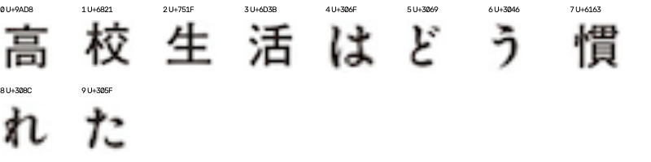
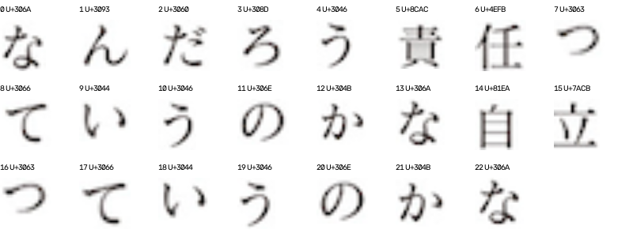
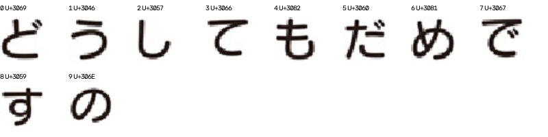
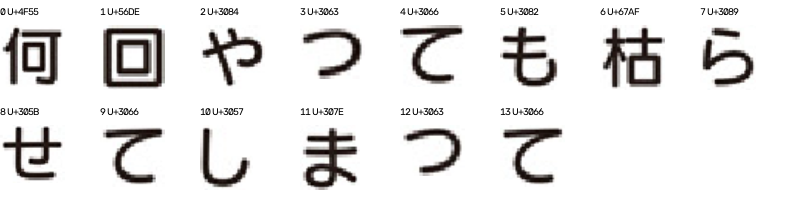
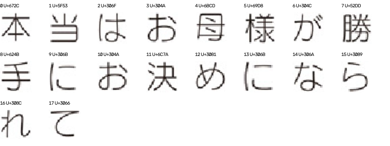
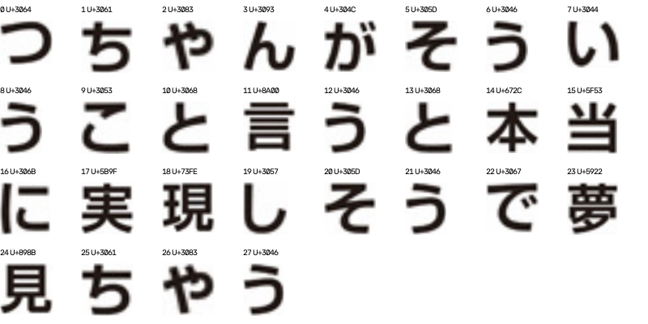
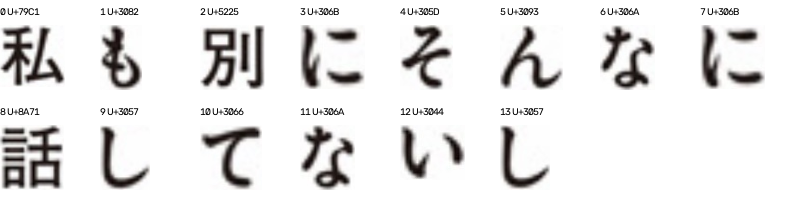
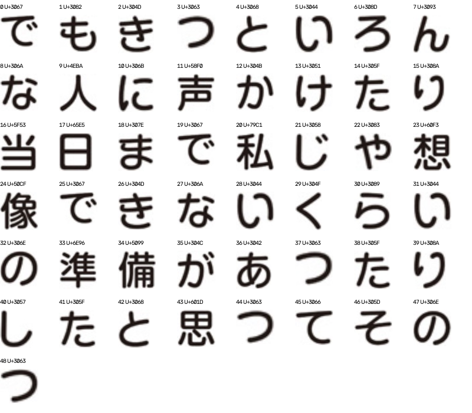

# 统一字形处理后的冻结新样本验证

## 结论

严格7字对照的8张新题中，两种策略均为7/8，没有配对改善或退步。3字为清晰度7/8、主动6/8；5字为6/8、5/8。Top-3在支持域8题均包含中文答案。统一处理链消除了度量不一致，但本轮仍未证明主动选字优于清晰度基线，不能宣布稳定提升或替换默认策略。
q10主动策略在3/5字时误判轻吟体，7字补回圆体；q21两策略所有预算均误判圆体，增加至全部裁片也未修正，属于不能仅靠选字解决的剩余失败。没有足够证据在本轮将其归因于某一种具体原因。
实验迭代在q1因无已知区分字停止，候选错误但证据指数为0；这应表示需要复核，而不是已识别成功。数值置信仍未校准，自动早停保持默认关闭。q11是白字黑底及少字的域外案例，原样保留但不计入严格主指标。
下一步应先独立核验共同失败样本的实际源字体/字形覆盖和输入模型，再设计新实验；不利用这次测试结果继续调参并重新声称盲测。

## 处理方式

模拟查询由同一128px字体模板裁紧灰度墨迹、降采样到16/24/32/48/64px，再调用实际截图所用normalize和score_pair。模板端与真实匹配相同。区分度采用双向跨字体混合距离减去同字体降采样距离，再取所有字重组合的最小非负值；不再采用固定em的Soft-IoU。
近似共享门槛改用已有匹配分差0.015，而不是旧Soft-IoU阈值0.12。预算、质量权重、候选数等不再调参。合成降采样不模拟所有真实压缩、描边和背景，仍非完美成像模型。
## 验证边界

策略与字体文件在新样本匹配前冻结。采样审计见[FRESH_SAMPLE_AUDIT.md](FRESH_SAMPLE_AUDIT.md)。字符和裁片经视觉标注；这不是OCR端到端测试。题库提供中文答案大类，不能据此断言识别了精确日文字体。独立题目也不必然是独立漫画来源。
主指标预先指定为7字预算的中文答案Top-1一致率，3/5字和Top-3是次指标。自动早停只作探索性记录，不默认启用。

## 同预算结果

| 策略 | Top-1 | Top-3 | 总取字数 |
|---|---:|---:|---:|
| quality_3 | 7/9 | 8/9 | 26 |
| active_3 | 6/9 | 8/9 | 26 |
| quality_5 | 6/9 | 8/9 | 42 |
| active_5 | 5/9 | 8/9 | 42 |
| quality_7 | 7/9 | 8/9 | 58 |
| active_7 | 7/9 | 8/9 | 58 |
| iterative | 6/9 | 8/9 | 36 |
| all_pool_reference | 7/9 | 8/9 | 168 |

上表为全部题目的最多预算结果；少字题可能不足预算或出现重复补字，不视作严格等预算比较。
按匹配前补充约定，严格7字主指标纳入8题（≥7个不同可用字符）。

| 字数预算 | 清晰度优先 Top-1 | 统一处理的主动选字 Top-1 |
|---|---:|---:|
| 3 | 7/8 | 6/8 |
| 5 | 6/8 | 5/8 |
| 7 | 7/8 | 7/8 |

主指标配对变化：改善题目 []；退步题目 []。
对不一致配对作双侧精确符号检验：p=1.0000。小样本且可能同源，不能把未显著或一次提升解读成稳定泛化。

## 原始裁片与取字轨迹

下面按裁片池索引展示实际输入；U+为字符码。三种同预算策略均使用这些输入，不按识别成败筛除题目。

### q1 / 黑体

| 策略 | 选字顺序 | 首选 | Top-3家族 |
|---|---|---|---|
| quality_3 | 高活慣 | 黑体 | 攸望黑体（日文） / RodinHappy B / 新丸ゴ |
| active_3 | 高生活 | 黑体 | 攸望黑体（日文） / Antique AN+ / 新丸ゴ |
| quality_5 | 高活慣校生 | 圆体 | 新丸ゴ / 攸望黑体（日文） / RodinHappy B |
| active_5 | 高生活校慣 | 圆体 | 新丸ゴ / 攸望黑体（日文） / RodinHappy B |
| quality_7 | 高活慣校生れは | 黑体 | 攸望黑体（日文） / Antique AN+ / 新丸ゴ |
| active_7 | 高生活校慣れは | 黑体 | 攸望黑体（日文） / Antique AN+ / 新丸ゴ |
| iterative | 高生活校 | 圆体 | 新丸ゴ / 攸望黑体（日文） / RodinHappy B |

### q2 / 宋体

| 策略 | 选字顺序 | 首选 | Top-3家族 |
|---|---|---|---|
| quality_3 | のなか | 宋体 | Ryumin / Comic Mystery / Antique AN+ |
| active_3 | のうな | 宋体 | Ryumin / Comic Mystery / Antique AN+ |
| quality_5 | のなかろ自 | 宋体 | Ryumin / Comic Mystery / Folk |
| active_5 | のうな自か | 宋体 | Ryumin / Comic Mystery / Antique AN+ |
| quality_7 | のなかろ自んだ | 宋体 | Ryumin / Comic Mystery / Antique AN+ |
| active_7 | のうな自かな任 | 宋体 | Ryumin / Comic Mystery / Antique AN+ |
| iterative | のうな自 | 宋体 | Ryumin / Folk / Comic Mystery |

### q5 / 圆体

| 策略 | 选字顺序 | 首选 | Top-3家族 |
|---|---|---|---|
| quality_3 | すだめ | 圆体 | 新丸ゴ / Skip / Folk |
| active_3 | すうも | 圆体 | 新丸ゴ / 攸望黑体（日文） / RodinHappy B |
| quality_5 | すだめども | 圆体 | 新丸ゴ / Folk / RodinHappy B |
| active_5 | すうもだで | 圆体 | 新丸ゴ / 攸望黑体（日文） / RodinHappy B |
| quality_7 | すだめどものて | 圆体 | 新丸ゴ / Folk / 攸望黑体（日文） |
| active_7 | すうもだでどて | 圆体 | 新丸ゴ / RodinHappy B / Skip |
| iterative | すうも | 圆体 | 新丸ゴ / 攸望黑体（日文） / RodinHappy B |

### q8 / 圆体

| 策略 | 选字顺序 | 首选 | Top-3家族 |
|---|---|---|---|
| quality_3 | 枯何せ | 圆体 | 新丸ゴ / Skip / Folk |
| active_3 | 枯もら | 圆体 | 新丸ゴ / 攸望黑体（日文） / Folk |
| quality_5 | 枯何せてや | 圆体 | 新丸ゴ / Skip / 攸望黑体（日文） |
| active_5 | 枯もらやせ | 圆体 | 新丸ゴ / Skip / 攸望黑体（日文） |
| quality_7 | 枯何せてや回も | 圆体 | 新丸ゴ / 攸望黑体（日文） / Skip |
| active_7 | 枯もらやせ回て | 圆体 | 新丸ゴ / 攸望黑体（日文） / Skip |
| iterative | 枯もら | 圆体 | 新丸ゴ / 攸望黑体（日文） / Folk |

### q10 / 圆体

| 策略 | 选字顺序 | 首选 | Top-3家族 |
|---|---|---|---|
| quality_3 | 手様決 | 圆体 | 新丸ゴ / Humming / RodinHappy L |
| active_3 | 手らお | 轻吟体 | Humming / Skip / 新丸ゴ |
| quality_5 | 手様決母め | 圆体 | 新丸ゴ / Humming / 攸望黑体（日文） |
| active_5 | 手らおなれ | 轻吟体 | Humming / 攸望黑体（日文） / 新丸ゴ |
| quality_7 | 手様決母めな勝 | 圆体 | 新丸ゴ / Humming / 攸望黑体（日文） |
| active_7 | 手らおなれ決が | 圆体 | 新丸ゴ / Humming / 攸望黑体（日文） |
| iterative | 手らおなれ決が | 圆体 | 新丸ゴ / Humming / 攸望黑体（日文） |

### q11 / 宋体

| 策略 | 选字顺序 | 首选 | Top-3家族 |
|---|---|---|---|
| quality_3 | さく | 海报体 | RodinHappy UB / Antique AN+ / 新丸ゴ |
| active_3 | さく | 海报体 | RodinHappy UB / Antique AN+ / 新丸ゴ |
| quality_5 | さく | 海报体 | RodinHappy UB / Antique AN+ / 新丸ゴ |
| active_5 | さく | 海报体 | RodinHappy UB / Antique AN+ / 新丸ゴ |
| quality_7 | さく | 海报体 | RodinHappy UB / Antique AN+ / 新丸ゴ |
| active_7 | さく | 海报体 | RodinHappy UB / Antique AN+ / 新丸ゴ |
| iterative | さく | 海报体 | RodinHappy UB / Antique AN+ / 新丸ゴ |

### q21 / 黑体

| 策略 | 选字顺序 | 首选 | Top-3家族 |
|---|---|---|---|
| quality_3 | 見当に | 圆体 | 新丸ゴ / 攸望黑体（日文） / RodinHappy B |
| active_3 | 見そう | 圆体 | 新丸ゴ / 攸望黑体（日文） / Folk |
| quality_5 | 見当にちこ | 圆体 | 新丸ゴ / 攸望黑体（日文） / RodinHappy B |
| active_5 | 見そうこゃ | 圆体 | 新丸ゴ / 攸望黑体（日文） / RodinHappy B |
| quality_7 | 見当にちこ言と | 圆体 | 新丸ゴ / 攸望黑体（日文） / RodinHappy B |
| active_7 | 見そうこゃいん | 圆体 | 新丸ゴ / 攸望黑体（日文） / RodinHappy B |
| iterative | 見そうこゃいん | 圆体 | 新丸ゴ / 攸望黑体（日文） / RodinHappy B |

### q26 / 黑体

| 策略 | 选字顺序 | 首选 | Top-3家族 |
|---|---|---|---|
| quality_3 | 別も私 | 黑体 | Antique AN+ / Ryumin / Comic Mystery |
| active_3 | 別もそ | 黑体 | Antique AN+ / Ryumin / Comic Mystery |
| quality_5 | 別も私にそ | 黑体 | Antique AN+ / Ryumin / Comic Mystery |
| active_5 | 別もそな私 | 黑体 | Antique AN+ / Ryumin / Comic Mystery |
| quality_7 | 別も私にそして | 黑体 | Antique AN+ / Ryumin / Comic Mystery |
| active_7 | 別もそな私ん話 | 黑体 | Antique AN+ / Ryumin / Comic Mystery |
| iterative | 別もそ | 黑体 | Antique AN+ / Ryumin / Comic Mystery |

### q28 / 圆体

| 策略 | 选字顺序 | 首选 | Top-3家族 |
|---|---|---|---|
| quality_3 | 日像き | 圆体 | 新丸ゴ / RodinHappy B / Humming |
| active_3 | 日りそ | 圆体 | 新丸ゴ / Humming / 攸望黑体（日文） |
| quality_5 | 日像き声準 | 圆体 | 新丸ゴ / RodinHappy B / 攸望黑体（日文） |
| active_5 | 日りそなら | 圆体 | 新丸ゴ / RodinHappy B / 攸望黑体（日文） |
| quality_7 | 日像き声準思当 | 圆体 | 新丸ゴ / RodinHappy B / 攸望黑体（日文） |
| active_7 | 日りそならたき | 圆体 | 新丸ゴ / RodinHappy B / 攸望黑体（日文） |
| iterative | 日りそ | 圆体 | 新丸ゴ / Humming / 攸望黑体（日文） |

## 置信解释与复现

confidence字段仍是未校准证据指数，不是正确概率；共享近似字形不投支持票、重复字不重复计票。即使多个字一致，也可能共享裁切或缺库误差。完整每字支持/反证、每轮候选与选择理由见results.json。
冻结文件：data/aligned-holdout-v2/protocol-freeze.json；结果：data/aligned-holdout-v2/results.json；按需生成的字体区分表：discrimination.json。旧版数据未覆盖。
评估入口validate_aligned_holdout.py拒绝覆盖第一次结果，拒绝在冻结代码/字体改变后评估。报告可运行 .venv/bin/python report_aligned_holdout.py 重新生成。
