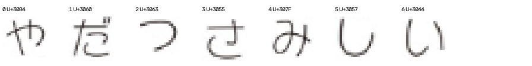
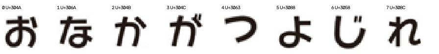
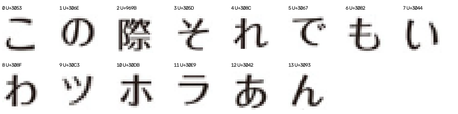
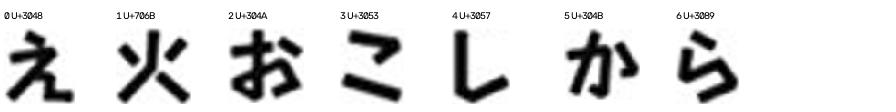
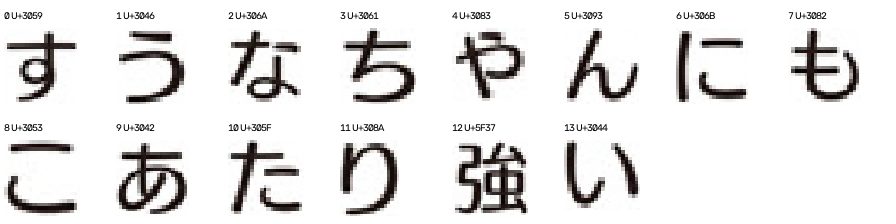

# 字体类别扩展验证

## 结论

44道合格题的7字对照：清晰度优先34/44，主动选字32/44；主动Top-3为41/44。仅看26道真正的新题，两者Top-1均为19/26，主动Top-3为23/26。主动选字有局部收益但没有稳定优势，继续保留清晰度基线，自动早停不启用。
新增类别中，方圆5/5、少女5/6、润圆/雅士黑4/5、竹体4/5；轻吟体仅1/6，主要混淆为方新书或润圆/雅士黑。优先核验轻吟体样本与所提供Humming文件的对应关系、字重覆盖及成像归一化，现有证据不足以认定题库错标或确定具体根因。少女q75两种策略都判方圆，同样应检查实际字形/字重证据，不自动改答案。
7字预算主动策略只改善q30，退步q100、q58、q83；新题中的q30改善与q83退步抵消。整体分数不能与之前8题结果直接比较，因为本轮扩大了类别且混有已见样本。以下结果保留为首轮冻结评估，没有用其继续调参。

## 范围与口径

筛选按已约定的字体家族：普通字重合并，少女/方圆/海报分开。题库总题量严格大于5且存在映射日文字体者纳入。8类共94道可选题，本轮每类固定6题，共48题；这不是94题全量测试。竹带体无对应字体、雷盖/雷鬼体仅5题，不纳入。
核心三类复用既有裁片，其余五类按题号升序取前6题，不按评分换题。新增标注按阅读顺序取最多14个不同可读常规字；不足字数、白字等限制保留。评估仍是已知字符的裁片字体匹配，不是自动OCR或整页检测。
沿用已冻结的统一归一化、同一模板端与混合距离、0.015区分门槛、23字体14家族，不利用扩展结果调参。比较双方在每题使用同一输入池。字库中的其他家族仍作为竞争候选，没有只保留答案涉及的8类。
严格主指标要求黑字且至少7个不同可用字符。少字/白字题保留在完整结果但不混入主指标；不能因为主指标排除而宣称这些输入已经支持。

样本暴露分层：{'previous_font_evaluation': 18, 'new_question': 29, 'previous_annotation_only': 1}。严格主指标共44题。未见只指本地历史记录，无作品级独立性保证。

## 每类结果：7字预算

| 类别 | 题库题数 | 本轮题数 | 主指标题数 | 清晰度 Top-1 | 主动 Top-1 | 主动 Top-3 |
|---|---:|---:|---:|---:|---:|---:|
| 圆体 | 20 | 6 | 6 | 6/6 | 5/6 | 6/6 |
| 宋体 | 12 | 6 | 5 | 5/5 | 5/5 | 5/5 |
| 黑体 | 20 | 6 | 6 | 4/6 | 3/6 | 6/6 |
| 少女 | 11 | 6 | 6 | 5/6 | 5/6 | 5/6 |
| 方圆 | 9 | 6 | 5 | 5/5 | 5/5 | 5/5 |
| 润圆/雅士黑 | 8 | 6 | 5 | 4/5 | 4/5 | 5/5 |
| 竹体 | 8 | 6 | 5 | 5/5 | 4/5 | 5/5 |
| 轻吟体 | 6 | 6 | 6 | 0/6 | 1/6 | 4/6 |

## 暴露分层与同预算结果

| 样本层 | 合格题数 | 字数 | 清晰度 Top-1 | 主动 Top-1 | 主动 Top-3 |
|---|---:|---:|---:|---:|---:|
| all | 44 | 3 | 33/44 | 33/44 | 41/44 |
| all | 44 | 5 | 31/44 | 32/44 | 41/44 |
| all | 44 | 7 | 34/44 | 32/44 | 41/44 |
| new_question | 26 | 3 | 20/26 | 20/26 | 24/26 |
| new_question | 26 | 5 | 19/26 | 21/26 | 23/26 |
| new_question | 26 | 7 | 19/26 | 19/26 | 23/26 |
| previous_annotation_only | 1 | 3 | 0/1 | 0/1 | 0/1 |
| previous_annotation_only | 1 | 5 | 0/1 | 0/1 | 1/1 |
| previous_annotation_only | 1 | 7 | 0/1 | 0/1 | 1/1 |
| previous_font_evaluation | 17 | 3 | 13/17 | 13/17 | 17/17 |
| previous_font_evaluation | 17 | 5 | 12/17 | 11/17 | 17/17 |
| previous_font_evaluation | 17 | 7 | 15/17 | 13/17 | 17/17 |

同题配对变化：主动选字改善 [30]；退步 [100, 58, 83]。

## 主动策略的主要误判

| 题库类别 → 首选类别 | 数量 |
|---|---:|
| 黑体 → 圆体 | 3 |
| 轻吟体 → 方新书 | 3 |
| 轻吟体 → 润圆/雅士黑 | 2 |
| 圆体 → 轻吟体 | 1 |
| 少女 → 方圆 | 1 |
| 润圆/雅士黑 → 方新书 | 1 |
| 竹体 → 黑体 | 1 |

## 全部题目（含不合格样本）

| qid | 答案 | 暴露 | 合格 | 主动取字 | 首选 | Top-3家族 |
|---|---|---|---|---|---|---|
| 5 | 圆体 | previous_font_evaluation | True | すうもだでどて | 圆体 | 新丸ゴ/RodinHappy B/Skip |
| 8 | 圆体 | previous_font_evaluation | True | 枯もらやせ回て | 圆体 | 新丸ゴ/攸望黑体（日文）/Skip |
| 10 | 圆体 | previous_font_evaluation | True | 手らおなれ決が | 圆体 | 新丸ゴ/Humming/攸望黑体（日文） |
| 28 | 圆体 | previous_font_evaluation | True | 日りそならたき | 圆体 | 新丸ゴ/RodinHappy B/攸望黑体（日文） |
| 91 | 圆体 | previous_font_evaluation | True | るでたきりとこ | 圆体 | 新丸ゴ/攸望黑体（日文）/Humming |
| 100 | 圆体 | previous_font_evaluation | True | 夜らなだがるか | 轻吟体 | Humming/新丸ゴ/攸望黑体（日文） |
| 2 | 宋体 | previous_font_evaluation | True | のうな自かな任 | 宋体 | Ryumin/Comic Mystery/Antique AN+ |
| 9 | 宋体 | previous_font_evaluation | True | 座りらうおはに | 宋体 | Ryumin/Comic Mystery/Antique AN+ |
| 11 | 宋体 | previous_font_evaluation | False | さく | 海报体 | RodinHappy UB/Antique AN+/新丸ゴ |
| 72 | 宋体 | previous_font_evaluation | True | をま法すて聖め | 宋体 | Ryumin/Comic Mystery/Antique AN+ |
| 92 | 宋体 | previous_font_evaluation | True | びも日うま清く | 宋体 | Ryumin/Comic Mystery/Antique AN+ |
| 114 | 宋体 | previous_font_evaluation | True | 椿さ月だなたん | 宋体 | Ryumin/Antique AN+/Comic Mystery |
| 1 | 黑体 | previous_font_evaluation | True | 高生活校慣れは | 黑体 | 攸望黑体（日文）/Antique AN+/新丸ゴ |
| 21 | 黑体 | previous_font_evaluation | True | 見そうこゃいん | 圆体 | 新丸ゴ/攸望黑体（日文）/RodinHappy B |
| 26 | 黑体 | previous_font_evaluation | True | 別もそな私ん話 | 黑体 | Antique AN+/Ryumin/Comic Mystery |
| 58 | 黑体 | previous_font_evaluation | True | ありただうとい | 圆体 | 新丸ゴ/攸望黑体（日文）/Skip |
| 96 | 黑体 | previous_font_evaluation | True | とさにか花をく | 圆体 | 新丸ゴ/攸望黑体（日文）/RodinHappy UB |
| 125 | 黑体 | previous_font_evaluation | True | 着りちも束す約 | 黑体 | Antique AN+/Ryumin/Comic Mystery |
| 3 | 少女 | new_question | True | みさいしだやっ | 少女 | RodinHappy L/RodinHappy B/新丸ゴ |
| 50 | 少女 | new_question | True | あなでも白す月 | 少女 | RodinHappy L/RodinHappy B/新丸ゴ |
| 51 | 少女 | new_question | True | はさにビじヒあ | 少女 | RodinHappy L/RodinHappy B/新丸ゴ |
| 75 | 少女 | new_question | True | 怪リがるもぜて | 方圆 | RodinHappy B/RodinHappy UB/新丸ゴ |
| 86 | 少女 | new_question | True | わなさかたい咲 | 少女 | RodinHappy L/RodinHappy B/新丸ゴ |
| 89 | 少女 | new_question | True | だリかオるけわ | 少女 | RodinHappy L/RodinHappy B/RodinHappy UB |
| 13 | 方圆 | new_question | True | かなおがよじれ | 方圆 | RodinHappy B/RodinHappy UB/新丸ゴ |
| 32 | 方圆 | new_question | False | 特ます設し | 方圆 | RodinHappy B/新丸ゴ/Skip |
| 44 | 方圆 | new_question | True | はたッかもベよ | 方圆 | RodinHappy B/新丸ゴ/RodinHappy UB |
| 57 | 方圆 | new_question | True | ちなきもですマ | 方圆 | RodinHappy B/RodinHappy UB/新丸ゴ |
| 71 | 方圆 | new_question | True | もうぞいトマま | 方圆 | RodinHappy B/RodinHappy UB/新丸ゴ |
| 87 | 方圆 | new_question | True | 今さにこビどて | 方圆 | RodinHappy B/新丸ゴ/RodinHappy UB |
| 4 | 润圆/雅士黑 | new_question | True | んもそわあれの | 方新书 | Folk/新丸ゴ/Skip |
| 6 | 润圆/雅士黑 | new_question | True | 遅ごたどれ先に | 润圆/雅士黑 | Skip/攸望黑体（日文）/Humming |
| 80 | 润圆/雅士黑 | new_question | False | 適やい快ー | 润圆/雅士黑 | Skip/新丸ゴ/Humming |
| 81 | 润圆/雅士黑 | new_question | True | ぁさ子衣わん芽 | 润圆/雅士黑 | Skip/Humming/新丸ゴ |
| 85 | 润圆/雅士黑 | new_question | True | 色ごさうれいち | 润圆/雅士黑 | Skip/Humming/攸望黑体（日文） |
| 90 | 润圆/雅士黑 | new_question | True | ばるせよけイ押 | 润圆/雅士黑 | Skip/Folk/Humming |
| 14 | 竹体 | new_question | True | おこらえ火しか | 竹体 | Take/攸望黑体（日文）/Antique AN+ |
| 24 | 竹体 | new_question | True | いうえなかんく | 竹体 | Take/攸望黑体（日文）/Folk |
| 35 | 竹体 | new_question | False | でなん | 竹体 | Take/Folk/Humming |
| 55 | 竹体 | new_question | True | ぱうとあでや言 | 竹体 | Take/攸望黑体（日文）/Antique AN+ |
| 83 | 竹体 | new_question | True | すでおいかしや | 黑体 | Antique AN+/Take/攸望黑体（日文） |
| 95 | 竹体 | new_question | True | 怪もにして妙奇 | 竹体 | Take/攸望黑体（日文）/Antique AN+ |
| 30 | 轻吟体 | new_question | True | にもなりたいん | 轻吟体 | Humming/Skip/新丸ゴ |
| 46 | 轻吟体 | new_question | True | 言ふさないれわ | 润圆/雅士黑 | Skip/Humming/新丸ゴ |
| 47 | 轻吟体 | new_question | True | 好そきなゃ優か | 润圆/雅士黑 | Skip/Humming/新丸ゴ |
| 106 | 轻吟体 | new_question | True | 触もただらでれ | 方新书 | Folk/攸望黑体（日文）/新丸ゴ |
| 108 | 轻吟体 | new_question | True | 私でもんする知 | 方新书 | Folk/新丸ゴ/Skip |
| 109 | 轻吟体 | previous_annotation_only | True | はえこおなちが | 方新书 | Folk/新丸ゴ/Humming |

## 新增类别原始裁片示例

裁片均来自原图，含原图bbox及哈希。每类展示第一题；完整review在三个lane目录。

### 少女 · q3

### 方圆 · q13

### 润圆/雅士黑 · q4

### 竹体 · q14

### 轻吟体 · q30

## 复现与限制

完整结果：data/category-expansion-v3/results.json；名单/历史暴露/冻结哈希：protocol.json；字体表：discrimination.json。构建及评估入口expand_font_categories.py，报告入口report_category_expansion.py。首次结果拒绝覆盖，旧测试和字体文件保留。
置信字段仍为未校准证据指数，不是正确概率，不能据此自动放行。Top-3命中是中文答案大类命中，不证明日文字体精确身份；未训练专用识别模型。类别均衡取样也不代表真实生产分布。
