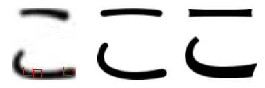
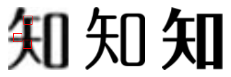

# 候选对差异热区：视觉复核与成熟方法对照

2026-09-21。本轮只增加独立诊断实验，不改变默认 v4 排名。代码：[差异热区](./contrastive_patch_v9.py)、[52 题复算](./evaluate_contrastive_v9.py)；[完整逐字结果](./data/contrastive-v9/final/results.json)。

## 视觉观察与算法验证

q109「こ」的源图下笔左侧有明显弯入和圆势，Humming–Skip 模板也在这些部位形成可见区别。v8 在 Humming–Folk 对上因 Folk 的端点为 `unknown`、无法三方对应，完全没有该字的局部证据。v9 改由**两张候选模板先产生差异热区**，再去原图比较，不要求端点先被分类。这样可以比较该字，但结果并非单向：Humming–Skip 的墨迹/边缘/骨架均支持 Humming，Humming–Folk 的三种表示却都支持 Folk。说明“绕过端点门槛”增加了覆盖，不保证找到正确字体；Folk 粗度及源图成像仍可能主导距离。

q108「知」的全字最大差异热区多落在左侧大笔画，而不是视觉上最值得比较的右侧`口`。对这个**已定位的细长闭合框单独限定区域**，该字的墨迹和边缘距离均转而支持 Humming 相对 Folk；骨架仍支持 Folk。更重要的是，`る、よ、す`中的环形留白也被粗略闭合孔检测纳入“框区域”，其结果偏向 Folk。因此，不能把所有带孔字符的局部证据直接加总，必须先区分规整框与假名环、再考虑同一笔段的方向和字重。

## 全类别开发回归

在 52 题中，61 个候选对恰有一方对应题库答案。无部位门槛的热区比较在 53 对有结果；墨迹、边缘、骨架三种表示各为 **43 对方向正确、10 对错误**。v8 局部端点/角点方案覆盖 47 对，36 对方向正确；在双方均覆盖的 47 对中，v9 墨迹方向为 39 对正确、8 对错误，比 v8 多 3 对净正确。闭合孔区域的墨迹对照覆盖 52 对、43 正/9 反，边缘为 39 正/13 反；它并未解决整题的 q108，也没有独立于现有图像挑选。Folk 控制类别的候选对是 2 正/4 反，尤其提醒不能直接接管排名。

这些统计是**候选对方向诊断，不是题目 Top-1 准确率**：同题的候选对、字符、三种图像表示相互相关；部分正确类别甚至不在前两名。旧 Top-1 因未接入 v9 仍为 38/44，轻吟体 3/6，Folk 控制题 1/4。全部样本此前已暴露，局部框实验又是在看过 q108 后设计，不能当盲测或校准后的置信度。

## 从成熟方法借鉴什么

- [Local Style Awareness of Font Images](https://arxiv.org/abs/2310.06337)通过同字体字形的对比学习寻找带有字体风格信息的局部，例如端点、曲率；支持**学习风格相关的局部注意**，但论文的生成任务结果不能直接换算成本项目识别准确率。
- [Paired-glyph Matching](https://arxiv.org/abs/2211.10967)把同一字体的不同字符拉近、不同字体拉开。适合我们未来用字体文件合成大量跨字符正负样本，减少“同一字的内容形状”压过字体风格的问题；现有代码尚未训练这种模型。
- Adobe 的 [DeepFont](https://research.adobe.com/publication/deepfont-identify-your-font-from-an-image/)明确处理合成字形与真实截图的域差异。这提示训练时应模拟漫画缩放、灰度、模糊、压缩、描边和背景，而不是只用洁净字体渲染；其公开报告的结果不适用于直接估算本题库表现。
- [Font Recognition Benchmark](https://arxiv.org/abs/2503.23768)发现通用视觉语言模型的细粒度字体识别有限、容易受文字语义影响。故视觉模型更适合作**发现错位和提出部位假设的辅助观察者**，不能替代可复算的图像证据或新题评估。

## 建议的下一实验边界

先区分“规整闭合框、假名环、自由端点、交叉/连接”四类可解释部位。每类只从同一部位的跨字体模板对照产生注意图，并对图像成像参数做**整行共享**的有限估计，避免逐字逐候选任意调模糊来获胜。若再引入学习模型，优先用现有字体库做成对字形的对比学习，加上真实漫画退化模拟；按**原图/页/作品分组**留出新样本，报告各字体类的 Top-1、Top-3、拒识率和校准，而不靠同题候选对票数宣称上线收益。

验证：120 项单元测试通过；旧 48 题、619 个题目字形和 168 个旧裁片哈希通过；v9 的 52 题结果及代码/输入哈希一致。没有新增依赖，也未改旧样本或默认推断入口。
