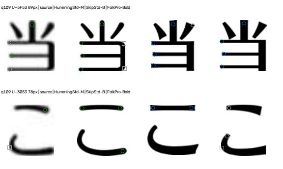
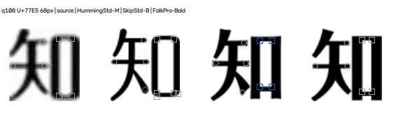

# 短笔段、闭合框与字形比例变化的对应实验

2026-09-21。实验入口已实现：[rank_font_correspondence.py](./rank_font_correspondence.py)。结果：q109「こ」此前漏掉的同笔段端点现在能对应；q108「知」右侧细长闭合框也能在源图与三种模板里定位。**这些改进尚未提高整题Top-1；其他字体类别也未观察到可证实的准确率提升。** 默认识别继续使用v4。

## 1. 对应方式的变化

v6以全字等比缩放、小幅平移后的像素距离对应部位。字形横向比例不同，源图和模板的同一端点可能超过12像素距离门槛。v7在**对应坐标**时根据各自墨迹外框分别映射横、纵比例，范围限制为0.74–1.35；端帽、角形本身仍按各自原灰度图测量，没有拉伸局部形状。

自由端点先检查朝向，再要求互为最近且距离≤12个128画布像素。若骨架构成独立且无分叉的片段，还比较该片段的中心位置。这个中心是同一笔段的**近似线索**，复杂相连汉字无法由它恢复真实笔顺。没有可靠片段信息时只用位置、朝向和唯一对应，保留误配风险。

闭合框先找真正封闭的留白区，即使水平短边过短，也保留其四角位置但记为unknown。跨模板对应要求同类部位、同一角角色（左上/右上/右下/左下）、框中心接近，而且双方必须映射到截图中的同一个角。只在源图和两个模板都明确判断为方/圆且方向相反时投票。缺边、低分辨率、三个灰度阈值结果不稳定均弃权。

每对候选仍每字最多一票；至少三个不同字、80%一致、同向明确方形锚点，以及原外观前两名进入0.015歧义带，才会改变前两名。这个保守重排规则沿用v6，因此新增部位证据也可能只用于解释。方形权重2，圆形权重1；不是估算概率。

## 2. 关键图像与失败边界

下图标记：圆圈是自由端点，方框是连接/闭合框角点；蓝=方形正证据，绿=圆形正证据，灰=不确定。列依次为源灰度、Humming、Skip、Folk；标题列出的代表字重为准。放大只便于展示，不增加原生图像信息。

### q109「こ」：对应成功，整题不变

源图上横右端、Humming圆端与Skip方切端原本均能检测，但v6统一对齐把Skip端点移出了距离门槛。v7分别映射横纵比例，并核对这根孤立横笔的中心，三者现在对应为同一部位；该字从0票变为**支持Humming相对Skip的一票**。这只解决一个候选对的一个字；Humming相对Folk的票及整题外观领先保护没有改变，q109仍输出Folk。

[q109原图](./data/images/q109.png) · [逐字证据](./data/correspondence-v7/final/results.json)

### q108「知」：孔能对应，转角仍不可靠

「知」右侧`口`是窄长框。源图内孔约19×83个归一化像素；Humming、Skip、Folk模板均有对应内孔。Folk较粗、孔较窄，以前因短横边证据不足而整块漏掉；v7将它定位，保留四个unknown角点。源图四角同样因阈值波动而unknown，所以**没有因看见圆角就给Humming投票**。

孔开口的宽/高相对邻近笔宽可供诊断：源图约(0.543, 0.838)，Humming约(0.658, 0.857)，Skip约(0.500, 0.788)，Folk约(0.441, 0.798)。宽高分别指向不同候选；这些数值没有被当成方圆判定或硬排名票。`知`仍为0票。q108其它`私、る、で`的圆端软证据沿用v6，整题仍为Folk。

[q108原图](./data/images/q108.png) · [对应记录](./data/correspondence-v7/final/q108-focus.json)

### 仍无法对应/判断的情形

q109「当」虽有视觉上的转角，却没有检出闭合内孔；本轮没有把它错误标成`口`类闭合框。q106「け」和多数小字的邻近原生笔宽不足，依旧弃权。四角定位也不代表方圆分类可靠：在全部题目实际用到的386个裁片中，闭合框角点候选756个，733个unknown、16个rounded、7个square；跨字体真正形成模板方/圆差异的闭合框角点仅3项，其截图角点均unknown。这些数字统计的是候选，不是检测召回率。

## 3. 全类别回归：其他字体有没有获益？

| 题库类别 | 七字题数 | v6正确 | v7正确 |
| --- | ---: | ---: | ---: |
| 圆体 | 6 | 6 | 6 |
| 宋体 | 5 | 5 | 5 |
| 黑体 | 6 | 5 | 5 |
| 少女 | 6 | 5 | 5 |
| 方圆 | 5 | 5 | 5 |
| 润圆/雅士黑 | 5 | 4 | 4 |
| 竹体 | 5 | 5 | 5 |
| 轻吟体 | 6 | 3 | 3 |
| **主指标** | **44** | **38** | **38** |

另有4道Folk控制题，v6/v7均1/4；其中3道满足七字条件，均1/3。q11白字继续拒绝识别，不把它当错误猜测或主指标样本。没有题目的Top-1变化，也没有新增错误。全量记录见[results.json](./data/correspondence-v7/final/results.json)。

单字层面，在877个**非Humming候选对×字符**中，有效方向票由50增至51：新增的一票是q86「た」在方圆与圆体之间支持方圆，而该题题库答案是少女。它没有提供对正确类别的新支持，也没有改变排名。24px假名模板对照仍0/222可区分；48px仍33/222，64px由90增至91/222。说明比例对应略增了模板对照覆盖，**还不能称为其他字体识别优化**。

在818个包含Humming的候选对×字符中，有效票54→56，新增2票、无失票或方向反转；其中1票在题库映射的正确方向上。数字不能当独立样本数，同一题、字可能进入多个候选对。对错仍以44题、4控制题分别报告。[分类与逐字变化汇总](./data/correspondence-v7/final/summary.json) · [假名模板表](./data/correspondence-v7/final/kana-table.json)

其余失败保留：q21黑体→圆体，q75少女→方圆，q4雅士黑→方新书，q106/108/109轻吟体→方新书；Folk控制q79/127/128仍失败。q86那张新票还提示：部位对应变多，并不保证它帮助正确类别。

## 4. 验证与接下来的瓶颈

闭合框合成测试覆盖矩形孔、圆角孔、短边、旋转、圆环、断开的框及低分辨率；不支持的形状保留unknown。真实样本和全部旧原图/裁片未被改写。正式冻结记录保存代码快照、输入哈希和参数：[freeze.json](./data/correspondence-v7/final/freeze.json)。所有真实题此前均已暴露，本报告是开发回归，不是新的未调参验证。

最明显的下一步不是继续扩大坐标容差，而是获得短边/连接角在原生像素上的更稳定证据。q108「知」已能找到框，方圆角仍会随阈值改变；把unknown强行解释为圆角会把定位进步误写成识别进步。其他字体目前无准确率收益，故v7保留为实验入口，默认v4不变。

实现文件：[闭合框特征](./closed_box_features.py)、[结构对应](./stroke_correspondence_v7.py)、[候选入口](./rank_font_correspondence.py)、[回归导出](./evaluate_correspondence_v7.py)、[实时复验](./verify_correspondence_v7.py)。没有增加依赖。

验证：112项单元测试通过；52题从实时入口逐题复算与冻结结果一致；旧样本的619个原图/题目记录及168个裁片哈希校验通过。报告内本地链接均可解析。
