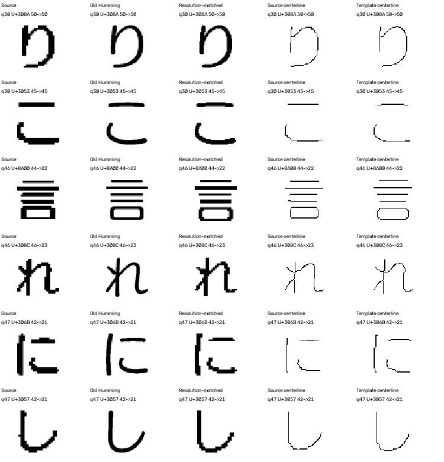

# 轻吟体：视觉诊断与保守规则修正

## 结论

推荐的7字清晰度输入加保守重排：轻吟体由0/6变为3/6；整体合格样本由34/44变为38/44，没有新增中文大类错误。修正q30、q46、q47及黑体q96。q106、q108、q109仍返回Folk，未擅改题库答案或加Humming奖励。
这些结果是开发回归，不是新盲测。六题已用于诊断；新增4题Folk负例暴露了全局几何替换的回退问题，并用于收紧保护规则，因此它们也不能再称独立盲测。

## 原因与证据

1. **确认的栅格问题：** q46/q47存在周期性精确2倍行列重复；例如q46的46px墨迹实际约23px，原系统高估有效分辨率。修正规则要求两个轴同时具有稳定重复相位，不仅凭尺寸或模糊程度猜测；q30压缩后的阶梯不满足该严格证据，没有强行认定缩放倍数。
2. **证据支持的形状/粗细混杂：** Humming与Skip不少假名相似，旧像素外观匹配会偏向笔画黑量相近者。宽度弱化的骨架对照能更好保留q30/46/47的结构差异。新规则仍保留50%原外观项，避免完全抹掉少女/方圆/海报的字重差别。
3. **未解决的模板一致性问题：** q106/108/109在原外观、笔画粗细补偿、分辨率对齐及骨架探针中，整体均更接近现有Folk参考；但独立视觉观察发现q108「知」、q109「当」等局部圆转支持Humming。因此不能据此宣称它们确定是Folk或题库错标。需要原排版字体/真实字重或更多Humming参考来区分字库覆盖不足与标签对应问题。
4. **下调的假设：** 统一横向压缩没有得到支持，六题相对Humming字形宽高比中位数约0.975–1.021，差异主要局部；简单统一加粗也未修正后三题，所以没有把这些试验当作默认修复。

## 实际改动

- 识别有强像素证据的整数放大，估算有效分辨率。真实匹配与字形区分表共用同分辨率参考构造。
- 将原混合外观距离与骨架几何距离各占50%，二者使用同一个受限对齐，避免逐字挑不一致的变形。没有字体名奖励或按题号分支。
- 默认不全局替换：只有原外观候选差距≤既有0.015门槛时才让几何重排，且只能提升原本接近的候选；明显领先者保留。几何最优落到该集合外则标记冲突，不强行提升。
- 原像素、旧模板和所有冻结回归结果均保留；白字入口显式拒绝而非返回虚假的可靠字体。分数不包装为概率，auto_accept始终为false。

## 六题逐题结果

| 题号 | 原清晰度首选 | 修正后首选 | 状态 |
|---|---|---|---|
| 30 | 润圆/雅士黑 | 轻吟体 | ambiguous_candidates_geometry_reranked |
| 46 | 润圆/雅士黑 | 轻吟体 | ambiguous_candidates_geometry_reranked |
| 47 | 润圆/雅士黑 | 轻吟体 | ambiguous_candidates_geometry_reranked |
| 106 | 方新书 | 方新书 | appearance_lead_preserved |
| 108 | 方新书 | 方新书 | appearance_lead_preserved |
| 109 | 方新书 | 方新书 | appearance_lead_preserved |

## 负例与拒绝的方案

单纯全局几何替换让原本正确的Folk q132变成Skip，因此没有采用。保守重排保住q132。4题Folk负例最终与原方案完全相同：仅q132正确，即1/4；满足7字条件的3题为1/3。这不是Folk识别已解决的证据，只证明本批未新增Folk误判。q127本来就误判Humming，仍标记证据冲突，未隐瞒这个原有问题。
主动选字的新几何实验为35/44，仍弱于默认清晰度+保护方案38/44，并引入q10/q92退步，继续不作为默认。

## 文件与运行

- 独立视觉审阅：HUMMING_VISUAL_REVIEW.md。
- 可调用入口：rank_font_guarded.rank_sample(sample, template_directory, budget=7)。命令示例：`.venv/bin/python rank_font_guarded.py --qid 46`。返回Top-3、两种距离、有效分辨率和证据状态，不返回假概率。
- 核心规则：glyph_geometry.py、geometry_font_matcher.py、resolve_font_ambiguity.py。
- 探针：data/humming-v4/stroke-probe.json、resolution-probe.json、skeleton-probe.json。
- 保留的第一轮全局替换实验：data/humming-v4/regression/；最终保护结果：data/humming-v4/guarded-results.json。
- 下一步优先补齐后三题可核验的源字体或对应样式，而不是继续按这六题调规则。
