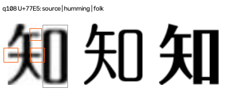
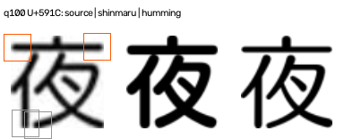

# 无训练成对注意力：稳定度、部位约束与弃权

2026-09-21。v10 为**独立诊断入口**，未改变默认 v4 排名或旧样本。评估前已写入[冻结记录](./data/pair-attention-v10/final/freeze.json)，包含算法和评估代码快照、参数、输入哈希与预定协议。52 题均在此前开发中暴露，因此这是冻结后的**开发回归**，不是新题盲测。

## 如何计算成对注意力

对每个已知字及候选 A/B，先在原图定位结构部位：多个灰度阈值下仍接近矩形的闭合留白记作`rect_box`；骨架自由端记作`free_end`，不要求它先被分成方/圆。源图不足 32 个有效像素、自由端原生笔宽不足 3.5 像素时弃权。q108「知」的窄框被保留，`る、よ、す`的环形孔不会被当成规整框。

模板 A/B 按源图整体字形比例对齐；每对模板共用 0、0.65、1.25 三档模糊。仅保留三档下持续存在、并扣除同模板成像波动后仍明显的差异热区。每个部位同时比较原图与 A/B 的墨迹和边缘：两种表示的方向必须相同，且三档模糊下的局部距离方向必须一致，才贡献一票。一个字的部位相互冲突则该字弃权；候选对至少需**两个不同字符**有票，且 ≥80% 同向，才输出诊断方向。所有门槛来自[算法政策](./pair_attention_v10.py)，不是概率校准。

## 冻结回归结果

在 52 题中，有 61 个候选对恰好一方对应题库答案：**21 对方向正确、2 对方向错误、38 对弃权**。决定覆盖为 23/61；仅在已决定的对中是 21/23，但这些候选对和字符高度相关，不能等同题目准确率。Folk 控制类的 6 个可比候选对均弃权。默认 Top-1 仍是此前的 38/44，轻吟体 3/6，Folk 控制题 1/4——v10 没有重排。

逐题见[结果](./data/pair-attention-v10/final/results.json)与[汇总](./data/pair-attention-v10/final/summary.json)。q106 的 Humming–Folk 和 Humming–Skip 对均支持轻吟体；q109 两个对的字间证据冲突，正确弃权。q21 黑体对圆体也因字间冲突弃权。

## 两个不能忽视的误判

q108「知」虽找到了近矩形框，**框本身因墨迹与边缘或模糊稳定度不足而弃权**；左侧几个开放端点却稳定地支持 Folk。整题 Humming–Folk 对中，6 个有票的字符全偏向 Folk，形成稳定但错误的候选对判断。图中蓝框支持左侧候选 Humming，橙框支持右侧 Folk，灰框弃权。

q100 圆体对轻吟体的误判仅由「夜」「だ」两个字的开放端点组成，达到了当前最低两字门槛；其他字大多部位冲突而弃权。它说明“至少两字一致”仍可能过于宽松，尤其当两字共享同一种系统性成像偏差时。**不能在看过这一例后把门槛改为三字并称之为本轮验证结果**；那会成为新规则，必须用新题复验。

## 结论与界限

规整框/假名环分离和成像扰动一致性让证据更可解释，也显著增加弃权；但共同的字重、描边、比例差异可以在多档模糊下**稳定地产生错误方向**。v10 因而保持诊断状态，不生成可用于自动接受的置信概率。下一轮若继续改规则，应在新的原图/作品分组样本上检验；当前 52 题不能反复调门槛直到结果看起来更好。

验证：124 项单元测试通过；52 题实时复算与冻结结果一致，全部冻结代码和输入哈希通过；旧 48 题/619 字形及 168 个裁片哈希通过。无新增依赖。
