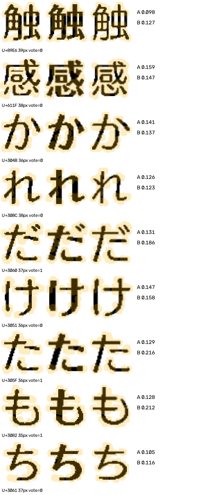
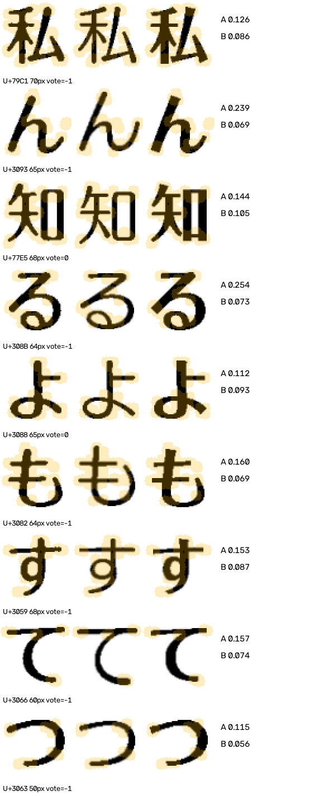
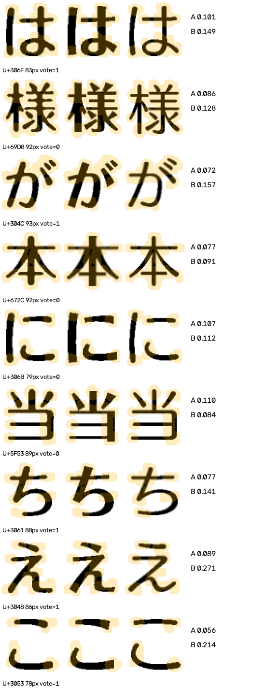

# 局部笔端、角点比对：失败案例与规则作用报告

2026-09-21。结论：**实验已接入，但未证明识别提升，不替换 v4 默认入口。**

## 1. 回归结果

| 范围 | v4 | v5 局部轮廓实验 |
| --- | --- | --- |
| 满足七字条件的主样本 | 38/44 | 38/44 |
| 其中轻吟体 | 3/6 | 3/6 |
| Folk 控制，包含六字 q79 | 1/4 | 1/4 |
| Folk 控制，仅满足七字条件 | 1/3 | 1/3 |
| 新增正确 / 新增错误 | — | 0 / 0 |

52 个输入均检查；q11 白字输入拒绝输出候选，不计入 44 题主指标。其余少字样本作为辅助案例。所有题此前均已暴露，**这是开发回归，不是新盲测**。题库答案是中文映射标签，并非来源排版文件对日文字体身份的直接证明。

最终数据：[逐字证据与前三候选](../data/contours-v5/final/results.json)、[代码/输入哈希及固定参数](../data/contours-v5/final/freeze.json)。上一级目录保留首次实验，最终目录修正了缓存白字结果的拒绝处理，没有根据正确率调整轮廓阈值。

## 2. 这些字体特征到底在哪里生效？

“轻吟接近有粗细变化的圆体、雅士黑接近有粗细变化的黑体”目前是**特征设计假设**，不是写入程序的分类结论。代码中没有“比较圆就给轻吟加分”的规则。

| 阶段 | 已实现行为 | 对结果的实际影响 |
| --- | --- | --- |
| 字库对照 | 同一个字按有效分辨率生成模板；提取骨架端点和图像角点候选，比较附近的轮廓 | 判断该字能否区分某一对候选；不是识别截图 |
| 初始识别 | 沿用 v4：七个质量较好的不同字，全字外观距离与受保护的骨架重排 | 产生字体族候选及每族统一代表字重 |
| 补字 | 从尚未使用的不同字中，按“字库区分量减去噪声门槛 × 裁片质量”选字；每对最多补两个 | 实际改变送入局部比对的字符，选择时不读取其截图匹配分数 |
| 截图比对 | 对每个候选沿用全字对齐，取两模板局部区域的并集，在同一片区域比较截图与模板轮廓 | 产生逐字支持、反对和弃权证据 |
| 候选重排 | 只有当前前两名同时处于原外观分数最佳值 +0.015 内，且至少三票、非弃权票至少 80% 一致时，才允许交换前两名 | 本轮没有发生交换；不能把“接入”说成“提升” |
| 解释与复核 | 记录分辨率不足、局部冲突、补字、候选与分数；另固定检查 Humming–Skip、Humming–Folk | 不改变标签；清晰领先者之外的对照仅作诊断 |

字体族仍合并不同字重；少女、方圆、海报保持独立。每个样本、每个字体族使用 v4 选出的**同一个代表字重**，没有逐字挑最有利字重。

离线表和在线比对均调用 `template_evidence`，模板均由 `GeometryReferences.reference` 生成。JSON 表是审计快照，在线按实际字符及分辨率用同一算法即时计算，不用旧版不一致的字形表。在线角点位置来自模板，不由 LLM 指定；LLM 的视觉复核用于解释失败，未参与打分或修改答案。

## 3. 实际比对算法与边界

1. 对齐仍为现有的等比缩放和小幅平移；不拉伸单个笔画。
2. 骨架仅用来定位端点，保留原有二值轮廓做评分；图像角点候选也加入半径 5 像素窗口。**图像角点不等于语义上的转折；这版也没有分开汇总端点与连接角点。**
3. 将轮廓转成有符号距离场：墨迹内部为正、外部为负，截断到 ±3 像素。在候选双方共有的窗口并集内计算平均绝对距离。
4. 允许最多 ±0.75 个归一化像素的统一距离偏移，以减少整体粗细影响；这不是字重恢复模型，不能消除非均匀加粗或不同笔段的粗细差。
5. 字库同字差异必须大于 `max(0.04, 2×自扰动噪声)`；自扰动为 ±0.35 像素平移加阈值变化。有效字号小于 32 像素直接弃权。截图两候选分差还须超过 `max(0.02, 自扰动噪声)` 才投票。

这些是预先固定的工程门槛，**不是经过真实扫描分布校准的可辨识性定理或概率**。自扰动很有限，不能模拟所有扫描、JPEG、背景和描边问题。现阶段仍在 64×64 二值化空间评分，细微端头信息可能已损失；统一全字对齐和窗口并集也会把字宽、位置与粗细差带入“局部”分数。

## 4. 字库区分表

覆盖现有模板中的 **74 个不同假名**，Humming-M 对 Skip-M、Skip-B、Folk-B 三种字面对照，5 档有效字号，共 **1110 条**。这不是全部平假名/片假名的完整表，也没有声称覆盖所有字重。

| 有效字号 | 通过工程门槛的字面对照 / 总数 |
| --- | --- |
| 16 | 0/222，按分辨率规则弃权 |
| 24 | 0/222，按分辨率规则弃权 |
| 32 | 174/222 |
| 48 | 176/222 |
| 64 | 174/222 |

48 像素下，Humming-M 与 Skip-M 的区分余量较大的字包括 `キ、く、マ、み、か、オ、ち、あ`；换成 Skip-B，排序会变化。这些是**当前局部距离的差异排序**，尚不能称为纯圆端特征强度或真实识别价值。

[完整表](../data/contours-v5/final/kana-table.json)。q30 实际补入 `り、い` 进行 Humming–Skip 对照，其中 `り` 提供了支持 Humming 的第三张有效票；其最终答案原本已正确，所以属于补充解释证据，而非新增正确题。

## 5. 轻吟体的三个失败案例

下列图片按字符逐行排列，黄色为实际局部评分窗口。左列是归一化截图，另两列是已对齐模板；**不是原图笔端的无损放大**。A/B 越低越近，vote=1 支持 A、-1 支持 B、0 弃权。每题 A/B 顺序见标题，不能跨图假定列序相同。原图链接供检查二值化前证据。

### q106：局部证据分歧，不支持统一强判

题库：轻吟体；输出：Folk / 方新书。前两名外观距离约 0.195 与 0.222，超过 0.015 歧义带。

视觉复核：`け` 左笔较直，`た` 短横和 `ち` 横笔并非稳定圆端证据，部分局部容许 Skip-M；`感` 的圆转不足以单独定族。当前局部评分中，Folk–Humming 的 `だ、た、も` 三票偏 Folk；Humming–Skip 则经补字得到三票偏 Humming。**战胜 Skip 不代表已经战胜 Folk。** 即使取消领先保护，也不会因此变成正确答案。

下图 A=Folk-B，B=Humming-M。`感` 对 Humming 略近，但差值不足投票；不能只展示支持目标答案的局部。

[原图](../data/images/q106.png)。后续方向：分离真实端点与连接角点；在原生灰度尺度验证软化和粗度影响，而不是直接降低投票阈值。

### q108：圆角被局部平均分淹没

题库：轻吟体；输出：Folk / 方新书。Humming 未进入当前前三；Folk 明显领先。固定诊断面板仍检查了 Humming，避免漏掉候选外反证。

视觉最有价值的是 `知` 右侧 `口`：圆转、下角没有明显外伸竖脚。**它是连接角点证据，不是自由笔端证据。** 然而当前窗口包含左半字、线宽和对齐误差：该字 Humming 0.144、Folk 0.105，仍未支持 Humming；`ん、る、も、す` 等更明显偏 Folk。说明目前算法没有把视觉上关心的那一个角点独立提取出来。

下图 A=Humming-M，B=Folk-B。

[原图](../data/images/q108.png)。后续方向：先做字库之间的对应笔段/角点配准，分别报告 `口` 下角与其他区域；再验证这些局部在字重扰动后是否保持区分力。不能用题库答案手工圈定该题专用加分区。

### q109：确有局部支持，但多数分数仍受外观影响

题库：轻吟体；输出：Folk / 方新书。前两名外观距离约 0.133 与 0.152，仍在保护范围之外。

`当` 的 Humming 局部距离约 0.084，优于 Folk 的 0.110，但未越过该字噪声门槛；Humming–Skip 中 `当、に` 有两张支持票，仍不足三票。反过来，视觉上圆端明显的 `こ`，当前距离却是 Folk 0.056、Humming 0.214；`え` 的短尾也偏 Folk。这是重要反例：**当前局部轮廓距离不是纯粹的圆润程度估计。** 补字可能增强错误方向，而非自动修复识别。

下图 A=Folk-B，B=Humming-M。

[原图](../data/images/q109.png)。后续方向：粗度作为整行共享的干扰参数建模，比较端头相对于相邻直笔的形状；同时保留 `え` 的短尾作为反证。现有证据不能断定原文用了某个未提供的 Humming 字重、合成加粗或横向压缩。

## 6. 其余全部失败与拒绝案例

| 案例 | 题库 → 输出 | 本轮证据与尚未解决的原因 |
| --- | --- | --- |
| [q21](../data/contours-v5/final/q21-local.png) | 黑体 → 圆体 | 圆体对攸望黑体的局部有效票仍多数支持圆体；不仅是保护门槛问题。不能靠 Humming 特征修复其他族的对应关系。 |
| [q75](../data/contours-v5/final/q75-local.png) | 少女 → 方圆 | 局部对照也支持现有方圆候选；少女/方圆是必须保留的字重边界。不能把所有粗细影响一律消除。 |
| [q4](../data/contours-v5/final/q4-local.png) | 雅士黑 → 方新书 | 选字有效字号约 14–18px，全部弃权；对低分辨率端点硬打分不可靠。 |
| [q79](../data/contours-v5/final/q79-local.png) | 方新书 → 圆体 | 仅六个不同字，Folk 对照没有足够一致局部票；列入控制集但不纳入七字指标。 |
| [q127](../data/contours-v5/final/q127-local.png) | 方新书 → 轻吟体 | 22–26px，局部证据弃权，原有错误保留。 |
| [q128](../data/contours-v5/final/q128-local.png) | 方新书 → 圆体 | 22–29px，局部证据弃权；前两名重排也不能直接提升第三名 Folk。 |
| [q11 原图](../data/images/q11.png) | 宋体 → 拒绝识别 | 白字域外输入，不将缓存旧预测伪装成有效 v5 结果；不计入主准确率。 |

控制图默认显示当前前两候选，具体 A/B 字面和行字符见最终 JSON 的 `image` 字段。q21/q75 的局部支持当前错误候选，只能证明这个特征未解决失败，不能据此认定题库答案错误。

## 7. 结论与下一轮验收条件

本轮实现了“字库区分性 → 补字 → 同字局部轮廓 → 保守重排/证据解释”的完整实验支路。**有效的是可追踪的证据链，不是已经提升的识别率。** 默认保留 v4，v5 仅作实验入口。

下一轮优先解决特征本身，而非放开保护门槛：

1. 端点、连接角点分开建模，并建立同一笔段的对应关系；不要把全部角点窗口平均成一个“圆润分”。
2. 在原生灰度尺度估计局部笔宽，以相邻笔段作参照；用整行共享的粗度参数解释加粗，同时保留少女/方圆/海报的有意义字重边界。
3. 字库区分性必须经多种字号、模糊、阈值与粗度扰动检验；字体之间距离大但扫描后不稳定的字，不应成为优先补字。
4. 先要求 `知/当` 的连接特征与 `こ` 的自由端头分别给出可复核解释，并保持 `え`、q106 的反证；随后冻结方案，用新的未调参样本验收。不能只围绕这三道已知失败继续报告开发集提升。

## 8. 文件、运行与验证

- [局部算法](../mikan_font_probe/local_contour_matcher.py)：窗口、轮廓距离、噪声与投票。
- [可运行实验入口](../mikan_font_probe/rank_font_contours.py)：选字、候选比对、前三候选与解释；`--qid 109`。
- [回归导出](../mikan_font_probe/evaluate_contours_v5.py)：冻结、假名表、所有失败证据图；重复实验须指定新的 `--output`，不覆盖完成结果。
- [实时入口验证](../mikan_font_probe/verify_contours_v5.py)：将答案替换为无效标签后重新运行，逐题核对前三、全部局部证据及哈希。
- [单元测试](../tests/test_local_contour_matcher.py)：同图、轮廓差、低分辨率、共享字形、投票和白字拒绝。

输出为未校准证据，不是“正确概率”。未修改原图、字体、裁片、v4 规则或旧冻结实验；没有新增依赖。

验证结果：52 题实时入口的前三候选和全部局部证据与最终记录一致；替换输入答案不改变结果；代码/输入哈希匹配。旧类别扩展 619 裁片原像素与协议检查、旧统一处理链 168 裁片哈希检查均通过。完整单元测试包含强制局部票验证的实际重排分支与清晰领先保护，而不只是检查本轮“零交换”的结果。
