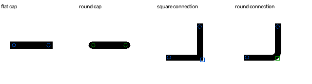
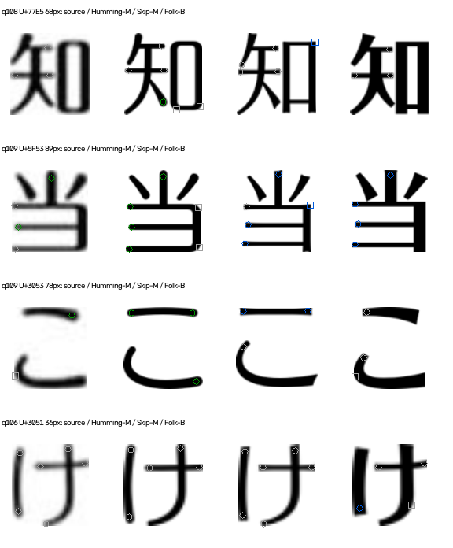

# v6：自由笔端、连接角点分开建模

2026-09-21。实现完成；**局部解释有所改善，整题准确率尚未改善**。默认仍为 v4，v6 为可运行的实验入口。

## 1. “方角更好辨认”如何落实

方角有较明确的正证据：一段平直的切面，或两条相邻直边集中交会。这个思路值得利用，但不能扩大成“看不到方角就是圆角”。模糊、低分辨率和笔段相接都可能抹掉方角，也可能产生假的像素角。

现在分别建模两种部位，不再把全部局部窗口平均成一个距离：

| 部位 | 参照尺度 | 方形的正证据 | 圆形的正证据 |
| --- | --- | --- | --- |
| 自由笔端 | 沿端点向内追踪，测相邻直笔段的横截面宽度 | 横向多个采样位置的前缘，可由平切面模型较好解释 | 前缘可由圆帽模型较好解释，且优于平切面；不是平面拟合失败就算圆 |
| 连接角点 | 两侧邻接笔段的局部宽度 | 邻边近直线，转向集中，两直线延长交点接近实际轮廓 | 中部有独立圆弧证据，偏离尖角交点，两侧仍有可辨直边 |

笔端的形状偏差除以邻近半笔宽；角点的直线残差、交点距离、圆弧半径等除以邻近笔宽。这样，同样的“圆帽”不会因为整体更粗而自动变成不同种特征。仍然没有模拟/恢复原字体字重，不保证完全消除粗细与灰度处理的干扰。

**没有推断起笔/收笔顺序。** 印刷字形只提供几何端点；代码对两端都检查，不将骨架追踪方向冒充真实笔顺。

下图为合成控制。圆圈标自由笔端，方框标连接角点；蓝色=明确平切/方角，绿色=独立圆形证据，灰色=不确定。标记形状表示部位类别，颜色才表示判别结果。



## 2. 为何能比上一版更有针对性

v5 在64×64二值图中，将端点和所有图像角点附近窗口混合评分，线宽及位置差仍占很大影响。v6 改为：

1. 保留灰度，统一到128画布、墨迹最大尺寸104；模板先按源图有效字号栅格化。放大仅便于测量，**不会增加原始分辨率**。
2. 自由端点通过骨架和局部直笔段检验；连接角点通过邻接笔段、两侧边缘和转折检验。端头旁的小角、交叉、连续圆弧不是自动认可的连接角点。
3. 三个灰度阈值（中心阈值±20）下判别须一致；自由端点要求原生局部笔宽至少5px，连接角点至少6px。否则保留unknown。
4. 字库同字、同类部位先建立双向最近对应；笔端还检查朝向。两模板必须在该部位分别有明确square和rounded，才构成有区分力的特征。
5. 对截图再建立对应，必须确认双方模板都对应到**同一个截图特征**。丢失或对应不确定的部位弃权，不能找一个“看着相似”的其他端点凑票。

这些都是工程模型和门槛，不是已被真实漫画数据验证的普遍定律。角点目前只分析外轮廓；紧凑内角、复杂交叉和短笔段覆盖不足。

## 3. 怎样影响选字、排名和解释

完整实验入口：[mikan_font_probe/rank_font_features.py](../mikan_font_probe/rank_font_features.py)。运行：

```sh
.venv/bin/python -m mikan_font_probe.rank_font_features --qid 109
```

先沿用v4的七字质量选择、全字外观/骨架候选及固定代表字重；然后在候选对之间，按**模板的可区分部位数×裁片质量**最多补两个不同字。选字时读取未选裁片来测有效字号，但不计算或读取其截图匹配分数，也不读答案标签。

每个字体族整题使用同一个代表字重；不逐字选最有利字重。少女、方圆、海报仍保持三个身份。

目前方形支持的权重为2，独立圆形支持的权重为1；每字最多贡献一张方向票，避免同字多个端点刷票。候选共识要求至少三个不同字、80%方向一致。**此实验另外要求至少一个同方向的明确方形锚点，纯圆形共识只作软证据。** 这个严格保护可能过度压低圆形字体的可用性，是待验证的策略，不是字体识别的必然要求。

只有当前前两名同时落在原外观最佳分数+0.015的范围内，才允许据此交换；其他候选对仅用于诊断。输出完整前三、逐字端点/角点证据、方形/圆形支持、弃权原因，不输出伪校准概率。

检查并修复了两个边界问题：反对方的方形票不能为圆形赢家充当锚点；未入选、不可用的白字不能清空已有有效排名。正式结果使用修正后代码。

## 4. 验证结果：区分解释改善，Top-1不变

| 范围 | v4/v5 | v6 |
| --- | --- | --- |
| 七字主样本 | 38/44 | 38/44 |
| 轻吟体 | 3/6 | 3/6 |
| Folk控制（含六字q79） | 1/4 | 1/4 |
| 新增正确 / 新增错误 | — | 0 / 0 |

52题检查，q11白字拒绝；其他少字题不计入44题主指标。所有题均已暴露，属于开发回归，**不是新的独立验证**。日文字体身份仍以题库的中文映射标签作代理，不能据此证明原排版的精确字体或字重。

本轮实际测量的386个裁片中：

| 部位 | 候选数量 | 明确方形 | 明确圆形 | unknown |
| --- | --- | --- | --- | --- |
| 自由笔端 | 1193 | 52 | 101 | 1040 |
| 连接角点 | 241 | 2 | 2 | 237 |

这只统计被检出的候选，不包括根本未定位到的部位，**不是召回率**。尤其连接角点仅4个候选通过门槛，实际可用性仍很低。不能把测试通过描述成“漫画角点已可靠解决”。

假名表使用同一算法，74个假名、Humming-M对Skip-M/Skip-B/Folk-B、24/48/64三档，共666条。24px有0/222条可区分，48px有33/222，64px有90/222；本轮表中的明确差异全部来自笔端，尚没有通过完整对应和稳定性条件的角点差异。[完整表](../data/features-v6/final/kana-table.json)

## 5. 关键案例：改善了什么，仍失败在哪里

下图为**额外诊断检查**，不会把未入选部位补进正式投票。列顺序：源图灰度、Humming-M、Skip-M、Folk-B；正式匹配的Skip代表字重可能为B，逐题记录为准。标记沿用蓝方、绿圆、灰unknown。



### q109：当、に等的笔端证据转向Humming

Humming对Folk获得8个不同字的圆形支持、1字弃权；对Skip获得6字支持、3字弃权。相较v5多数局部距离偏Folk，**证据方向确实改善**。但全是圆形软证据，没有同方向方形锚点；Humming与Folk还处于原0.015重排带之外，Top-1仍保留Folk。

`当` 本轮的有效支持主要来自自由笔端，并非已经识别出右侧连接圆角。`こ` 的上横右端则被独立判为圆端，Humming对应形态为圆、Skip为平切；**正式匹配中该部位未通过双方对应同一截图点的检查，因此该字仍为0票**。这展示了两个不同问题：形状判别进步，不等于对应关系已经解决。

[整题特征图](../data/features-v6/final/q109-features.png) · [原图](../data/images/q109.png)

### q108：私、る、で提供支持，但知的口角仍未可靠定位

Humming对Skip、对Folk各有3字圆形支持。`知` 右侧口部的圆转在视觉上有价值，但源图的连接部位没有通过角点提取，剩余三个自由端点也因原生笔宽不足而unknown。**不能把私、る、で的改善冒充知的角点问题已解决。** 整题仍输出Folk。

[整题特征图](../data/features-v6/final/q108-features.png) · [原图](../data/images/q108.png)

### q106：分辨率不足，明确弃权

实际入选部位为33个笔端候选、3个角点候选，全部unknown。`け` 的端点笔宽约数个原生像素，放大后虽能见到边缘，不足以据此作稳定方圆判定。尚无新证据推翻Folk；也不能用预期答案给Humming补票。

[整题特征图](../data/features-v6/final/q106-features.png) · [原图](../data/images/q106.png)

### 已正确的q30、q46、q47

均保持Humming。q46/q47有效像素较低，新特征全部弃权；q30有部分平切端测量，但没有形成有效字体对照票，不能把这些测量直接理解为整题属于方头字体。仍沿用原有正确结果。

### 其他失败未消失

q21黑体→圆体、q75少女→方圆、q4雅士黑→Folk，以及控制q79/q128方新书→圆体、q127方新书→Humming，均与原结果相同。q11是白字拒绝而非新的错误猜测。全部失败列表和旧视觉证据见[前轮失败报告](./CONTOUR_FAILURE_REPORT.md)，本轮逐题信息见[正式结果](../data/features-v6/final/results.json)。没有删除不利案例。

## 6. “方角更易辨认”的证据边界

180组笔端合成控制（两种形态×三种宽度×六个方向×五档分辨率）：应有360个自由端点，检出215个，明确判别141个，错误硬判0。其余是unknown或未检出；另24组模糊控制未出现方圆互判。不能只报“已判结果全对”而隐瞒覆盖不足。

30组连接角点控制（两种形态×三宽度×五方向）：方角7/15正检，圆滑4/15正检，8个unknown、11个未检出，错误硬判0。**这个小型合成试验支持优先寻找明确方角作为工程方向，但不能证明在真实漫画上方角普遍更容易识别。** 基准L方/圆均能正检；圆环、端帽、十字、T形和实心块作为反例不提供角点硬判。

## 7. 结论与下一步

已经从“通用局部图像距离”推进到“部位分类＋邻近笔宽参照＋明确方圆几何证据”。自由笔端开始提供更符合观察的信号；**连接角点和部位对应仍是主要短板**，不能通过放松阈值掩盖。

最值得继续做的是短笔段/闭合框的部位对应，尤其`口`的转角，以及让模板同一笔段的端点在字形比例变化后仍能对应。之后应单独比较“要求方形锚点”和“允许强圆形共识”的冻结消融实验，检查其是否过度限制圆形字体；不应现在就声称必须有方角才能识别轻吟体。最终仍需用未参与调参的新样本验证。

核心文件：[笔端模型](../mikan_font_probe/stroke_terminal_features.py)、[角点模型](../mikan_font_probe/stroke_corner_features.py)、[对应与聚合](../mikan_font_probe/stroke_feature_matcher.py)、[可运行入口](../mikan_font_probe/rank_font_features.py)。正式冻结文件包含参数、哈希和源码快照：[freeze.json](../data/features-v6/final/freeze.json)。上一级目录保留初轮实验，正式结论只依据final目录。

未增加依赖，未修改旧默认规则、字体、原始裁片或v4/v5冻结结果。

验证：96项单元测试通过；52题重新从实际入口识别，前三、全部特征证据与正式记录一致，替换答案标签不改变结果。无新增主样本/控制集回归，v5/v6哈希一致。旧619裁片原像素及协议检查、旧168裁片哈希检查通过；新文件语法编译和报告链接检查通过。
